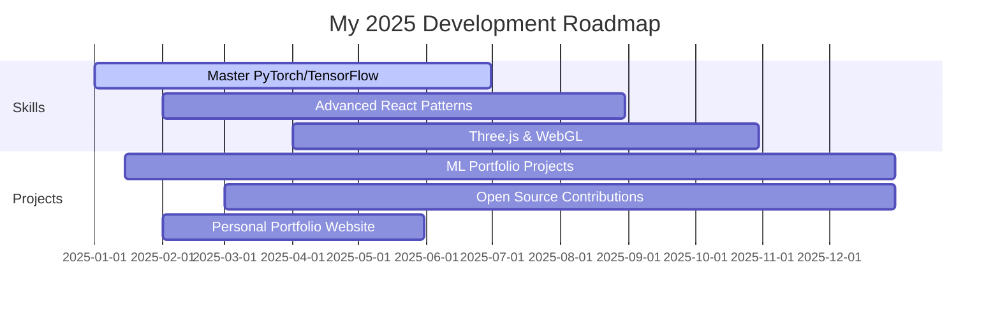

<div align="center">

<!-- Header with gradient background -->


</div>

<!-- Animated Introduction -->
<div align="center">
  
[](https://www.youtube.com/watch?v=SDkAGkd4NLc) 

</div>

<br>

<!-- Profile Stats Cards -->
<div align="center">
  
</div>

<br><br>

<!-- About Me Section with Cards Layout -->
<h2 align="center">
   
  About Me
  
</h2>

<div align="center">
  
```yaml
name: Sabarinath PS
located_in: Kerala, India
current_job: Frontend Developer & UI/UX Designer
education: 
  [
    "Self-taught Developer",
    "Continuous Learner"
  ]

fields_of_interests:
  [
    "Web Development",
    "UI/UX Design", 
    "Machine Learning",
    "Mobile Development"
  ]
  
technical_background:
  [
    "Frontend Development (React, Next.js)",
    "Backend Development (Node.js, NestJS)",
    "Database Management (MySQL)",
    "Machine Learning (Python, PyTorch, TensorFlow)"
  ]

currently_learning: ["PyTorch", "TensorFlow", "Advanced React Patterns"]
2025_goals: ["Master ML/AI", "Contribute to Open Source", "Build 10+ Projects"]
hobbies: ["Coding", "Designing", "3D Modeling", "Gaming"]
```

</div>

<br>

<!-- Tech Stack with Visual Cards -->
<h2 align="center">🛠️ Tech Stack</h2>

<div align="center">

### 🎨 Frontend Development


### ⚙️ Backend Development  


### 🐍 Programming Languages


### 🤖 Machine Learning & AI


### 🎨 Design & Creative Tools


### 🛠️ Tools & Platforms


</div>

<br>

<!-- Current Projects Section -->
<h2 align="center">🚀 What I'm Building</h2>

<div align="center">

<table>
<tr>
<td width="50%">
<h3 align="center">🌐 Web Design Company Website</h3>
<div align="center">

</div>
<p align="center">
<a href="https://quaint-dogfish-868.convex.app">🔗 Live Demo</a>  •  
<a href="#tech-used">⚡ React + Next.js</a>
</p>
</td>
<td width="50%">
<h3 align="center">🧠 ML Learning Journey</h3>
<div align="center">


</div>
<p align="center">
Building expertise in Machine Learning<br>
and Deep Learning frameworks
</p>
</td>
</tr>
</table>

</div>

<br>

<!-- GitHub Statistics with Beautiful Cards -->
<h2 align="center">📊 GitHub Analytics</h2>

<div align="center">


</div>

<div align="center">

</div>

<div align="center">

</div>

<br>

<!-- Skills Progress Bars -->
<h2 align="center">💪 Skills & Expertise</h2>

<div align="center">

**Frontend Development**


**Backend Development**


**Design & Creative**


</div>

<br>

<!-- Connect Section with Hover Effects -->
<h2 align="center">🤝 Let's Connect & Collaborate</h2>

<div align="center">

[](https://linkedin.com/in/sabarinath-ps)
[](https://twitter.com/@modernzeuxis)
[](https://instagram.com/ft.shambu)
[](mailto:psabarinath44@gmail.com)

</div>

<div align="center">

**💼 Portfolio:** [bento.me/sabarinath-ps](https://bento.me/sabarinath-ps)  
**📄 Resume:** [View My Experience](https://docs.google.com/document/d/1Twyx-PKlZn6Ex-XyjQPmAjnpQ6gS15DZ/edit?usp=sharing&ouid=111807181711037922142&rtpof=true&sd=true)

</div>

<br>

<!-- Professional Goals Section -->
<h2 align="center">🎯 2025 Professional Goals</h2>

<div align="center">



</div>

<br>

<!-- Quotes Section -->
<div align="center">
  
### 💭 Philosophy

> *"Design is not just what it looks like and feels like. Design is how it works."* - Steve Jobs

> *"Code is like humor. When you have to explain it, it's bad."* - Cory House

</div>

<br>

<!-- Footer with Animated Wave -->
<div align="center">


**⭐ From [sabarinath-ps](https://github.com/sabarinath-ps) with ❤️**


</div>
